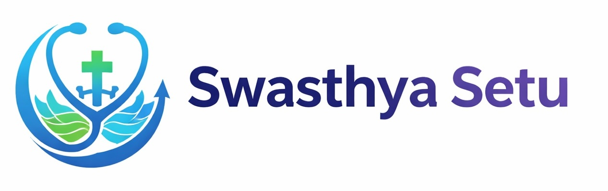
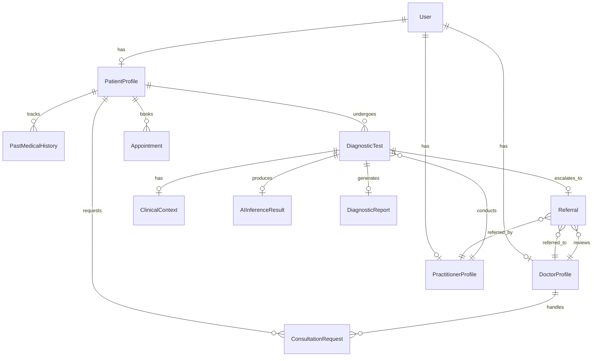
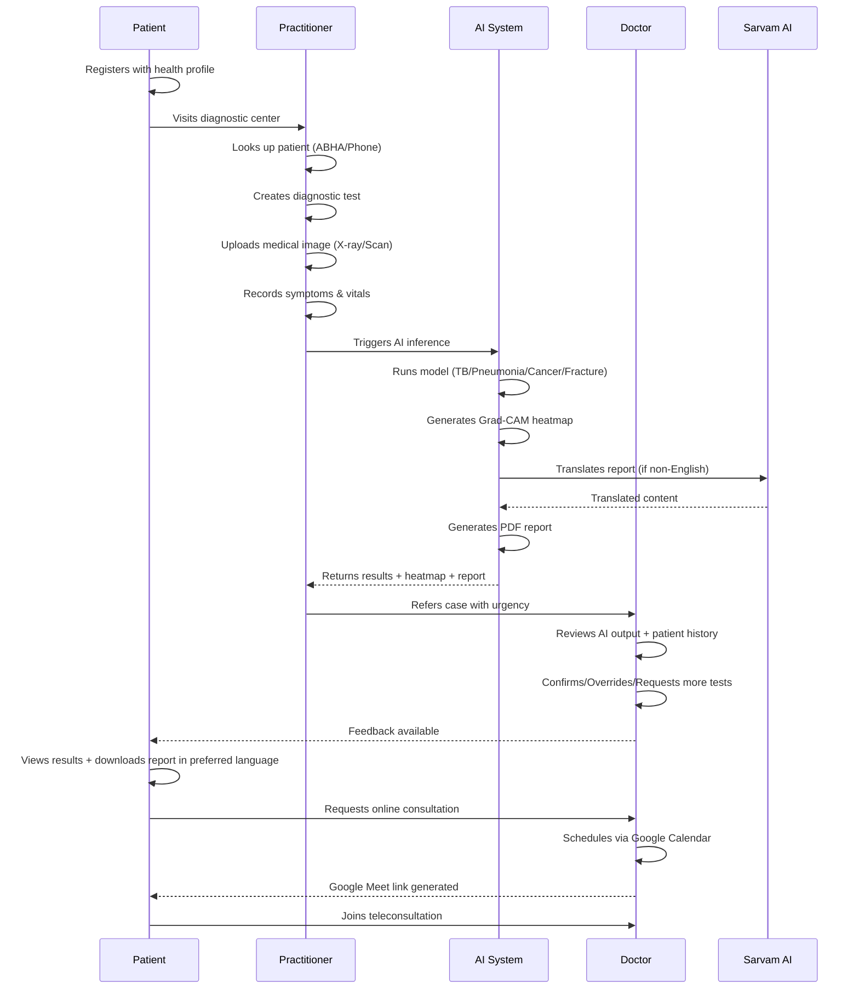

<p align="center">
  
</p>

<h1 align="center">🏥 Swasthya Setu</h1>

<p align="center">
  <strong>AI-Assisted, Doctor-Validated, Context-Aware Healthcare Coordination Platform — Built for India</strong>
</p>

<p align="center">
  <a href="#-architecture-overview"></a>
  <a href="#-ai-models--inference-pipeline"></a>
  <a href="#-technology-stack"></a>
  <a href="#-multilingual-reports"></a>
  <a href="LICENSE"></a>
</p>

---

## 📋 Table of Contents

- [Product Overview](#-product-overview)
- [Problem Statement](#-problem-statement)
- [Technology Stack](#%EF%B8%8F-technology-stack)
- [Architecture Overview](#-architecture-overview)
- [User Roles & Permissions](#-user-roles--permissions)
- [Data Models & Schema](#-data-models--schema)
- [AI Models & Inference Pipeline](#-ai-models--inference-pipeline)
- [Explainability — Grad-CAM Heatmaps](#-explainability--grad-cam-heatmaps)
- [Multilingual Reports — Sarvam AI](#-multilingual-reports--bhashini-api)
- [Google Calendar & Meet Integration](#-google-calendar--meet-integration)
- [Healthcare RAG System](#-healthcare-rag-system)
- [API Reference](#-api-reference)
- [Frontend Architecture](#-frontend-architecture)
- [Installation & Setup](#%EF%B8%8F-installation--setup)
- [Environment Variables](#-environment-variables)
- [Deployment](#-deployment)
- [End-to-End Workflow](#-end-to-end-workflow)
- [Security & Compliance](#-security--compliance)
- [Project Structure](#-project-structure)
- [Testing](#-testing)
- [Design Principles](#-design-principles)
- [Roadmap](#-roadmap)
- [Contributing](#-contributing)
- [License](#-license)

---

## 🎯 Product Overview

**Swasthya Setu** (स्वास्थ्य सेतु — "Health Bridge") is a multi-stakeholder, AI-assisted healthcare coordination platform designed to:

- **Reduce unnecessary hospital overload** through early AI-powered triage
- **Improve diagnostic accuracy** with explainable AI and doctor-in-the-loop validation
- **Enable context-aware diagnosis** by combining patient health history with real-time diagnostic imaging
- **Bridge language barriers** via multilingual report generation in 13+ Indian languages
- **Facilitate teleconsultation** through integrated Google Calendar & Meet scheduling

The platform follows a strict **"AI assists, Doctor decides"** philosophy — AI is never authoritative. Every AI inference must pass through a qualified doctor for validation before reaching the patient.

---

## 🏗 Problem Statement

Indian healthcare systems, especially government hospitals, face:

| Problem | Impact |
|---|---|
| **Overcrowding** | Premature/unnecessary diagnostic escalations flood hospitals |
| **Fragmented Records** | No structured longitudinal patient health history |
| **Language Barriers** | Patients cannot understand medical reports in English |
| **Delayed Triage** | Lack of AI-assisted early screening leads to late detection |
| **No Coordination Layer** | Patients, diagnostic centers, and doctors operate in silos |

Swasthya Setu acts as a **digital coordination layer** bridging patients, diagnostic practitioners, AI systems, and specialist doctors into a single, unified workflow.

---

## ⚙️ Technology Stack

### Backend

| Component | Technology | Version |
|---|---|---|
| **Framework** | Django + Django REST Framework | 6.0 / 3.16 |
| **Database** | PostgreSQL | — |
| **Authentication** | JWT via SimpleJWT | 5.5 |
| **AI/ML Runtime** | PyTorch + TorchVision + timm | 2.9 / 0.24 / 1.0 |
| **Image Processing** | OpenCV + Pillow + pydicom | 4.12 / 12.1 / 3.0 |
| **PDF Generation** | ReportLab | 4.4 |
| **Object Storage** | Cloudflare R2 (S3-compatible) via django-storages + boto3 | — |
| **Translation** | Sarvam AI (Indic Language API) | ULCA Pipeline |
| **Calendar Integration** | Google Calendar API + Google Meet | v3 |
| **CORS** | django-cors-headers | 4.9 |

### Frontend

| Component | Technology | Version |
|---|---|---|
| **Framework** | React | 19.1 |
| **Build Tool** | Vite | 7.1 |
| **Styling** | TailwindCSS v4 | 4.1 |
| **State Management** | Redux Toolkit (RTK Query) | 2.11 |
| **Routing** | React Router DOM | 7.11 |
| **Maps** | Mapbox GL JS + react-map-gl | 3.18 / 7.1 |
| **UI Primitives** | Radix UI (Dialog, Select, Label, Switch, Separator, Slot) | — |
| **Icons** | Lucide React | 0.562 |
| **Date Utilities** | date-fns | 4.1 |
| **CSS Utilities** | class-variance-authority, clsx, tailwind-merge | — |

### Healthcare RAG System (Standalone)

| Component | Technology |
|---|---|
| **Framework** | FastAPI |
| **Vector Database** | ChromaDB |
| **LLM** | Google Gemini |
| **Document Ingestion** | PDF/Text parsing + chunking |

### Infrastructure

| Component | Technology |
|---|---|
| **Frontend Hosting** | Vercel |
| **Backend Server** | Self-hosted (209.38.120.104) |
| **Object Storage** | Cloudflare R2 |
| **Database** | Neon PostgreSQL (cloud) |

---

## 🏛 Architecture Overview

```
┌─────────────────────────────────────────────────────────────────┐
│                        FRONTEND (React + Vite)                  │
│  ┌──────────┐  ┌──────────────┐  ┌──────────────┐              │
│  │ Patient  │  │ Practitioner │  │   Doctor     │              │
│  │Dashboard │  │  Dashboard   │  │  Dashboard   │              │
│  └────┬─────┘  └──────┬───────┘  └──────┬───────┘              │
│       │               │                 │                       │
│  ┌────┴───────────────┴─────────────────┴────────┐              │
│  │           Redux Store (RTK Query)             │              │
│  │  ┌─────────┐ ┌───────────┐ ┌────────────┐    │              │
│  │  │Patient  │ │Practitioner│ │  Doctor    │    │              │
│  │  │ApiSlice │ │ ApiSlice  │ │  ApiSlice  │    │              │
│  │  └─────────┘ └───────────┘ └────────────┘    │              │
│  └───────────────────┬───────────────────────────┘              │
└──────────────────────┼──────────────────────────────────────────┘
                       │ HTTPS (JWT Bearer)
                       ▼
┌──────────────────────────────────────────────────────────────────┐
│                    BACKEND (Django REST Framework)                │
│                                                                   │
│  ┌─────────┐  ┌──────────────┐  ┌──────────────┐  ┌──────────┐  │
│  │  Core   │  │   Patient    │  │ Practitioner │  │  Doctor  │  │
│  │  (Auth) │  │   Module     │  │   Module     │  │  Module  │  │
│  └─────────┘  └──────────────┘  └──────────────┘  └──────────┘  │
│                                                                   │
│  ┌─────────────────────────────────────────────────────────────┐  │
│  │                    AI / Intelligence Layer                   │  │
│  │  ┌─────────────┐ ┌──────┐ ┌───────┐ ┌─────────────────┐    │  │
│  │  │Breast Cancer│ │  TB  │ │Pneum. │ │Hairline Fracture│    │  │
│  │  │  (ResNet)   │ │(CNN- │ │(Eff.  │ │  (EfficientNet  │    │  │
│  │  │             │ │Trans)│ │ Net)  │ │      B3)        │    │  │
│  │  └─────────────┘ └──────┘ └───────┘ └─────────────────┘    │  │
│  │  ┌─────────────────┐  ┌──────────────────────────┐          │  │
│  │  │  Grad-CAM XAI   │  │ Report Generator (PDF)   │          │  │
│  │  └─────────────────┘  └──────────────────────────┘          │  │
│  └─────────────────────────────────────────────────────────────┘  │
│                                                                   │
│  ┌────────────────────────────────────────────────────────────┐   │
│  │              External Services                             │   │
│  │  ┌──────────────┐  ┌──────────────────────────────────┐    │   │
│  │  │ Sarvam AI │  │ Google Calendar + Meet API       │    │   │
│  │  │ (Translation)│  │ (Teleconsultation Scheduling)    │    │   │
│  │  └──────────────┘  └──────────────────────────────────┘    │   │
│  └────────────────────────────────────────────────────────────┘   │
│                                                                   │
│  ┌──────────────┐  ┌──────────────┐  ┌─────────────────────┐     │
│  │ PostgreSQL   │  │ Cloudflare   │  │  Local Model Store  │     │
│  │ (Neon Cloud) │  │ R2 Storage   │  │  (PyTorch weights)  │     │
│  └──────────────┘  └──────────────┘  └─────────────────────┘     │
└──────────────────────────────────────────────────────────────────┘
```

### Request Flow

1. **Frontend** sends authenticated requests via RTK Query with JWT Bearer tokens
2. **Django REST Framework** validates auth, enforces role-based permissions
3. **Business logic** in role-specific Django apps processes the request
4. **AI inference** is triggered on-demand by practitioners, running PyTorch models on uploaded diagnostic images
5. **Reports** are generated as PDFs with optional multilingual translation via Sarvam AI
6. **Media assets** (images, heatmaps, reports) are stored on Cloudflare R2

---

## 👥 User Roles & Permissions

### 1. Patient (`PATIENT`)
- **Profile**: Manages structured health profile (allergies, chronic conditions, medications, surgeries, lifestyle)
- **Medical History**: Maintains longitudinal history with ACTIVE/RESOLVED condition tracking
- **Tests & Reports**: Views diagnostic tests, AI results, and downloads multilingual PDF reports
- **Doctor Discovery**: Searches doctors by specialization, views availability timings
- **Practitioner Discovery**: Finds diagnostic centers on an interactive Mapbox map with filters
- **Consultations**: Requests online consultations with doctors, joins Google Meet sessions
- **Appointments**: Books in-person diagnostic appointments at practitioner centers

### 2. Practitioner (`PRACTITIONER`)
- **Patient Lookup**: Searches patients by phone number or ABHA ID
- **Test Management**: Creates diagnostic tests, uploads medical images (DICOM, PNG, JPG)
- **Clinical Context**: Records symptoms, vitals, and auto-captures patient health history snapshot
- **AI Inference**: Triggers AI model execution on uploaded images
- **Referral**: Refers cases to specialist doctors with urgency levels and reasons
- **Profile**: Manages center profile including geographic location (lat/lng for map discovery)

### 3. Doctor (`DOCTOR`)
- **Dashboard**: Summary statistics — pending referrals, reviewed today
- **Case Review**: Comprehensive view of patient data, AI results, Grad-CAM heatmaps, and health history
- **Decisions**: CONFIRM, OVERRIDE, or request MORE_TESTS on AI inferences
- **Consultation Management**: Accepts/rejects requests, schedules via Google Calendar + Meet
- **Reviewed Cases**: Historical archive of reviewed and closed referrals

### 4. AI System (Automated)
- Runs inference on diagnostic images
- Generates risk scores, confidence values, and prediction labels
- Produces Grad-CAM explainability heatmaps
- Generates structured PDF reports
- **Operates strictly under doctor oversight — no direct patient communication**

---

## 🗃 Data Models & Schema

### Core Entity Relationship



### Key Models

| Model | Purpose | Key Fields |
|---|---|---|
| **User** | Base user with RBAC | `id (UUID)`, `role`, `phone (unique)`, `abha_id`, `preferred_language` |
| **PatientProfile** | Structured health profile | `date_of_birth`, `blood_group`, `known_allergies`, `chronic_conditions`, `past_surgeries (JSON)`, `current_medications (JSON)`, `lifestyle_indicators (JSON)`, `medical_history (JSON)` |
| **DoctorProfile** | Medical professional info | `specialization`, `hospital_name`, `registration_number`, `years_of_experience`, `is_teleconsult_available`, `availability_timings (JSON)`, `latitude`, `longitude` |
| **PractitionerProfile** | Diagnostic center info | `designation`, `diagnostic_center_name`, `center_location`, `experience_years`, `services_offered (JSON)`, `latitude`, `longitude` |
| **DiagnosticTest** | A diagnostic procedure | `id (UUID)`, `test_type` (TB/BREAST_CANCER/PNEUMONIA/FRACTURE/DIABETIC_RETINOPATHY), `raw_image`, `status` (UPLOADED→AI_DONE→REFERRED→CLOSED) |
| **ClinicalContext** | Accompanying clinical data | `symptoms (JSON)`, `vitals (JSON)`, `auto_history_snapshot (JSON)` |
| **AIInferenceResult** | AI model output | `model_name`, `risk_score`, `risk_level` (LOW/MODERATE/HIGH), `confidence`, `prediction_label`, `heatmap_image` |
| **Referral** | Escalation to doctor | `urgency` (ROUTINE/HIGH), `reason`, `status` (PENDING→REVIEWED→CLOSED) |
| **ConsultationRequest** | Online doctor consultation | `status` (PENDING/SCHEDULED/COMPLETED/CANCELLED/REJECTED/NO_SHOW), `scheduled_time`, `meet_link`, `calendar_event_id` |
| **Appointment** | In-person diagnostic visit | `appointment_type`, `mode`, `scheduled_time`, `status` (BOOKED/COMPLETED/CANCELLED) |
| **DiagnosticReport** | Generated PDF report | `report_pdf`, `final_risk_level`, `doctor_signed` |
| **PastMedicalHistory** | Condition tracking | `condition_name`, `diagnosed_on`, `status` (ACTIVE/RESOLVED), `notes` |

### Supported Languages

The platform supports **13 Indian languages** for user preferences and report generation:

English, Hindi, Tamil, Telugu, Bengali, Marathi, Gujarati, Kannada, Malayalam, Punjabi, Odia, Assamese, Urdu

---

## 🤖 AI Models & Inference Pipeline

Swasthya Setu integrates **four trained deep learning models** for medical image analysis, with a fifth (Diabetic Retinopathy) awaiting pipeline integration.

### Model Inventory

| Model | Architecture | Input | Output Classes | Weight File | Size |
|---|---|---|---|---|---|
| **Breast Cancer** | Custom CNN (ResNet-based via timm) | Mammogram (DICOM/PNG) | Benign, Malignant | `breast_model.pkl` | ~16 MB |
| **Tuberculosis** | Hybrid CNN-Transformer | Chest X-Ray | Healthy, Sick, TB | `tb.pth` | ~266 MB |
| **Pneumonia** | EfficientNet-B0 (timm) | Chest X-Ray | Normal, Other, Pneumonia | `pneumonia.pt` | ~16 MB |
| **Hairline Fracture** | EfficientNet-B3 | Bone X-Ray | Fracture Detected, No Fracture | `hairline.pkl` | ~43 MB |
| **Diabetic Retinopathy** | _Awaiting integration_ | Retinal Scan | — | `diabetic.pkl` | ~44 MB |

### Inference Pipeline

```
                    Practitioner Triggers AI
                           │
                           ▼
                ┌──────────────────────┐
                │   ai_service.py      │
                │  (Orchestrator)      │
                └──────┬───────────────┘
                       │
          ┌────────────┼────────────┬────────────────┐
          ▼            ▼            ▼                ▼
    ┌──────────┐ ┌──────────┐ ┌──────────┐ ┌──────────────┐
    │ Breast   │ │   TB     │ │Pneumonia │ │  Fracture    │
    │ Cancer   │ │ Inference│ │Inference │ │  Inference   │
    │Inference │ │          │ │          │ │              │
    └────┬─────┘ └────┬─────┘ └────┬─────┘ └──────┬───────┘
         │            │            │               │
         └────────────┴────────────┴───────────────┘
                       │
                       ▼
              ┌────────────────┐
              │ AIInferenceResult │ ──→ DB
              │ + GradCAM Heatmap │ ──→ R2 Storage
              └────────┬───────┘
                       │
                       ▼
              ┌─────────────────────┐
              │  Report Generator   │
              │  (ReportLab PDF)    │
              │  + Sarvam AI i18n    │
              └─────────────────────┘
                       │
                       ▼
              ┌─────────────────────┐
              │  DiagnosticReport   │ ──→ R2 Storage
              └─────────────────────┘
```

### Model-Specific Details

#### Breast Cancer Detection
- **Preprocessing**: DICOM support with RescaleSlope/RescaleIntercept adjustment, window leveling (WindowCenter/WindowWidth), grayscale normalization
- **Inference**: 2-class classification (Benign/Malignant)
- **Explainability**: Grad-CAM on `conv_head` layer, JET colormap overlay

#### Tuberculosis Detection
- **Architecture**: Custom `HybridCNNTransformer` — CNN feature extraction → Transformer attention → classification
- **Preprocessing**: Standard ImageNet normalization (224×224)
- **Inference**: 3-class classification (Healthy/Sick/TB)
- **Risk Mapping**: TB → HIGH, Sick → MODERATE, Healthy → LOW
- **Explainability**: Manual Grad-CAM with `forward_features()` hook, matplotlib JET colormap, localization boxes on high-activation (>0.6) regions

#### Pneumonia Detection
- **Architecture**: EfficientNet-B0 (via timm, pretrained=False, 3 classes)
- **Preprocessing**: Thoracic region cropping (15%–85% width, 10%–95% height) + classical lung segmentation (CLAHE → Otsu threshold → morphological closing → contour masking)
- **Inference**: 3-class classification (Normal/Other/Pneumonia) with custom thresholding logic
- **Explainability**: Grad-CAM on `blocks[-2]`, lung-masked heatmap, bounding box on largest high-activation contour

#### Hairline Fracture Detection
- **Architecture**: EfficientNet-B3 with single sigmoid output
- **Preprocessing**: Medical preprocessing pipeline (CLAHE enhancement + sharpening + 512×512 resize) + spatial cropping
- **Inference**: Binary classification with configurable threshold (default 0.35)
- **Explainability**: Grad-CAM on `features[-2]`, top 30% strongest activations, morphological cleaning, bounding box

---

## 🔍 Explainability — Grad-CAM Heatmaps

Every AI inference generates a **Grad-CAM (Gradient-weighted Class Activation Mapping)** heatmap that visually highlights the regions of the medical image that most influenced the AI's prediction.

**How it works:**
1. Forward pass captures activations at a target convolutional layer
2. Backward pass computes gradients of the predicted class w.r.t. those activations
3. Gradients are globally average-pooled to get channel importance weights
4. Weighted combination of activation maps produces the class activation map
5. The CAM is overlaid on the original image as a JET colormap heatmap (0.6 × image + 0.4 × heatmap)
6. High-activation regions (>threshold) get bounding boxes for localization

**Purpose:** Enables doctors to visually verify whether the AI is "looking at the right regions" — a critical trust and safety mechanism.

---

## 🌐 Multilingual Reports — Sarvam AI

Swasthya Setu integrates with the **Sarvam AI** (Digital India Sarvam AI — MeitY, Government of India) for Neural Machine Translation of diagnostic reports.

### Translation Flow

```
┌───────────────┐     ┌──────────────────────┐     ┌──────────────────┐
│ Report Labels │────▶│ Sarvam AI ULCA        │────▶│ Translated PDF   │
│ + Symptoms    │     │ Pipeline API         │     │ (Noto Sans fonts)│
│ + AI Insights │     │ (NMT Translation)    │     │                  │
└───────────────┘     └──────────────────────┘     └──────────────────┘
```

### Key Features
- **Batch translation**: All report sections are translated in a single API call for efficiency
- **Medical term preservation**: Technical medical terms stay in English with translated explanations
- **Script-aware rendering**: Uses Noto Sans font family for proper Indic script rendering (Devanagari, Tamil, Telugu, Kannada, Gujarati, Bengali, Malayalam, Gurmukhi)
- **Fallback**: If translation fails, the English report is served as fallback
- **On-demand generation**: Reports can be regenerated in any supported language

---

## 📅 Google Calendar & Meet Integration

Teleconsultation scheduling is fully integrated with Google Calendar API and Google Meet:

### Workflow

1. **Patient** discovers a doctor and sends a consultation request
2. **Doctor** reviews pending requests and schedules a time slot
3. **System** creates a Google Calendar event with:
   - Auto-generated Google Meet link
   - Patient and doctor as participants
   - Email reminders (1 day before) and popup notifications (15 min before)
   - 30-minute default duration
4. **Both parties** can join via the Meet link from their dashboards
5. **Doctor** can reschedule, cancel, or reject requests

### Authentication
Uses Google Service Account credentials (`GOOGLE_APPLICATION_CREDENTIALS`) for server-to-server Calendar API access.

---

## 🗣️ Healthcare Voice Assistant & RAG System

A standalone **Voice-first, Retrieval-Augmented Generation (RAG)** system for healthcare knowledge queries, built as a separate FastAPI microservice. It acts as a real-time helpline agent, allowing patients to ask questions about their medical records over voice.

| Component | Details |
|---|---|
| **Framework** | FastAPI with `uvicorn` |
| **Voice Layer** | Web Speech API (STT & TTS) with Indian English/Hindi support |
| **Vector Store** | ChromaDB for document embeddings |
| **LLM** | Google Gemini 2.0 Flash (strict read-only grounding) |
| **Ingestion** | Document chunking for PDFs (Lab reports, Prescriptions) and Text |
| **Telemedicine Transcriber** | ASR pipeline for transcribing Doctor-Patient calls |
| **Safety** | Strict guardrails preventing medical advice or hallucinations |

### Core Data Pipelines (Sources of Truth)
The voice agent is strictly constrained to **three authoritative sources**:
1. **Diagnostic Reports**: Lab reports, blood tests, and imaging summaries.
2. **Prescription Reports**: Doctor-issued prescriptions with dosage and frequency.
3. **Doctor–Patient Call Transcripts**: Telemedicine consultations that are recorded and transcribed via an ASR (Automatic Speech Recognition) pipeline to serve as interactional evidence.

### Architecture
- `voice_assistant.html` — Interactive voice frontend (Web Speech API)
- `rag_engine.py` — Core retrieval + generation pipeline
- `vector_store.py` — ChromaDB vector storage management
- `gemini_service.py` — Gemini 2.0 prompt orchestration with continuous call logic
- `safety.py` — Content safety filter (blocks queries like "do I have cancer?")
- `query_normalizer.py` — Intent detection (symptoms, vitals, medicines, etc.)
- `language_layer.py` — Multilingual query handling

---

## 📡 API Reference

### Authentication

| Method | Endpoint | Description |
|---|---|---|
| `POST` | `/api/auth/register/` | Register new user (Patient/Practitioner/Doctor) |
| `POST` | `/api/auth/login/` | Login with phone + password, returns JWT + sets refresh cookie |
| `POST` | `/api/auth/refresh-token/` | Refresh expired access token using httpOnly cookie |
| `POST` | `/api/auth/logout/` | Clear refresh token cookie |

### Patient APIs

| Method | Endpoint | Description |
|---|---|---|
| `GET/PATCH` | `/api/patient/me/` | Get/update patient profile |
| `GET` | `/api/patient/tests/` | List all diagnostic tests |
| `GET` | `/api/patient/tests/<test_id>/` | Get detailed test info (AI results, referral, doctor review) |
| `GET` | `/api/patient/reports/<test_id>/?lang=hi` | Download PDF report in specified language |
| `GET/PATCH` | `/api/patient/medical-history/` | Get/update structured medical history |
| `GET` | `/api/patient/appointments/` | List appointments |
| `POST` | `/api/patient/appointments/book/` | Book an in-person diagnostic appointment |
| `GET` | `/api/patient/practitioners/` | Discover practitioners with location data |
| `GET` | `/api/patient/doctors/` | Discover doctors by specialization |
| `POST` | `/api/patient/consultations/request/` | Request online consultation with a doctor |
| `GET` | `/api/patient/consultations/` | List all consultations with status & Meet links |
| `GET` | `/api/patient/consultations/<id>/` | Get consultation details |
| `GET` | `/api/patient/referrals/` | List referrals and doctor decisions |

### Practitioner APIs

| Method | Endpoint | Description |
|---|---|---|
| `GET/PATCH` | `/api/practitioner/me/` | Get/update practitioner profile (incl. lat/lng) |
| `GET` | `/api/practitioner/patient-search/?phone=X` | Lookup patient by phone or ABHA ID |
| `GET` | `/api/practitioner/tests/active/` | List active (non-closed) tests |
| `GET` | `/api/practitioner/tests/closed/` | List closed/completed tests |
| `POST` | `/api/practitioner/tests/create/` | Create new diagnostic test |
| `GET` | `/api/practitioner/tests/<test_id>/` | Get test details with AI result & referral info |
| `POST` | `/api/practitioner/tests/<test_id>/upload/` | Upload diagnostic image (DICOM/PNG/JPG) |
| `POST` | `/api/practitioner/tests/<test_id>/context/` | Add clinical context (symptoms, vitals) |
| `POST` | `/api/practitioner/tests/<test_id>/run-ai/` | Trigger AI inference + report generation |
| `GET` | `/api/practitioner/tests/<test_id>/ai-result/` | Retrieve AI inference result |
| `POST` | `/api/practitioner/tests/<test_id>/refer/` | Refer case to a specialist doctor |
| `GET` | `/api/practitioner/tests/<test_id>/report/` | Download generated report |
| `POST` | `/api/practitioner/tests/<test_id>/regenerate-report/` | Regenerate report (e.g., different language) |
| `GET` | `/api/practitioner/doctors/` | List doctors (filterable by specialization) |

### Doctor APIs

| Method | Endpoint | Description |
|---|---|---|
| `GET` | `/api/doctor/me/` | Get doctor profile |
| `GET` | `/api/doctor/dashboard/stats/` | Dashboard summary statistics |
| `GET` | `/api/doctor/referrals/` | List pending referrals |
| `GET` | `/api/doctor/reviewed/` | List reviewed/closed referrals |
| `GET` | `/api/doctor/cases/<test_id>/` | Full case details (patient, AI result, heatmap, history) |
| `POST` | `/api/doctor/referrals/<id>/review/` | Submit review decision (CONFIRM/OVERRIDE/MORE_TESTS) |
| `POST` | `/api/doctor/referrals/<id>/close/` | Close a referral |
| `GET` | `/api/doctor/consultations/` | List all consultations |
| `GET` | `/api/doctor/consultations/<id>/` | Get consultation details |
| `POST` | `/api/doctor/consultations/<id>/schedule/` | Schedule consultation (creates Calendar event + Meet) |
| `POST` | `/api/doctor/consultations/create-schedule/` | Direct schedule creation |
| `POST` | `/api/doctor/consultations/<id>/reject/` | Reject a consultation request |
| `POST` | `/api/doctor/consultations/<id>/cancel/` | Cancel a scheduled consultation |
| `POST` | `/api/doctor/consultations/<id>/reschedule/` | Reschedule an existing consultation |

---

## 🎨 Frontend Architecture

### State Management

```
Redux Store
├── userSlice           ← Auth state (token, role, name, phone)
├── api (RTK Query)     ← Auto-caching, auto-invalidation
│   ├── userApiSlice    ← Auth endpoints (login, register, refresh)
│   ├── patientApiSlice ← Patient CRUD, tests, consultations
│   ├── practitionerApiSlice ← Tests, AI, referrals
│   └── doctorApiSlice  ← Referrals, reviews, consultations
```

### Routing Structure

```
/                              → Landing Page (Hero, HowItWorks, WhySection)
/login                         → Phone + Password Login
/register                      → Multi-step Role-based Registration

/patient                       → PatientDashboardLayout
├── /                          → Dashboard (health snapshot, stats)
├── /tests                     → List of diagnostic tests
├── /tests/:test_id            → Test detail (AI results, heatmap, report)
├── /appointments              → Diagnostic appointments management
├── /practitioners             → Discover diagnostic centers (Mapbox map)
├── /doctors                   → Discover doctors by specialization
├── /consultations             → Online consultation management
├── /referrals                 → View referral statuses
├── /medical-history           → Manage medical conditions (ACTIVE/RESOLVED)
├── /profile                   → View health profile
└── /profile/edit              → Edit comprehensive health profile

/practitioner                  → PractitionerDashboardLayout
├── /                          → Dashboard
├── /patient-lookup            → Search patients (phone/ABHA)
├── /active-tests              → Manage ongoing tests
├── /tests/:test_id/workflow   → 4-step test workflow (Upload→Context→AI→Refer)
└── /profile                   → Center profile with location picker

/doctor                        → DoctorDashboardLayout
├── /                          → Dashboard (stats, quick links)
├── /referrals                 → Pending referrals queue
├── /reviewed                  → Reviewed cases history
├── /cases/:test_id            → Full case review interface
├── /consultations             → Consultation management
└── /profile                   → Professional profile
```

### Key Components

| Component | Purpose |
|---|---|
| `AuthRestore` | Restores user session on page refresh via refresh token |
| `ErrorBoundary` | Global React error boundary with fallback UI |
| `RequireAuthAsPatient/Practitioner/Doctor` | Role-based route guards |
| `DashboardLayout` | Shared sidebar layout with role-specific navigation |
| `LocationPicker` | Mapbox-powered interactive location selector |
| `ReportManager` | Multilingual report download with language picker |
| `Dialog` | Radix UI dialog wrapper for modals |

### UI Component Library

Built on **Radix UI primitives** with TailwindCSS styling:

`Alert` · `Badge` · `Button` · `Card` · `Dialog` · `EmptyState` · `Input` · `Label` · `Select` · `Separator` · `Sheet` · `Switch` · `Table` · `Textarea`

---

## 🛠️ Installation & Setup

### Prerequisites

- **Python** 3.12+
- **Node.js** 20+
- **PostgreSQL** (local or cloud)
- **Cloudflare R2** or AWS S3 credentials
- **Google Cloud** project with Calendar API enabled
- **Sarvam AI** credentials (optional, for translation)
- **Mapbox** access token (for practitioner maps)

### Backend Setup

```bash
# 1. Clone the repository
git clone https://github.com/AdvityaDua/swasthya-setu.git
cd swasthya-setu/backend

# 2. Create virtual environment
python3 -m venv venv
source venv/bin/activate  # macOS/Linux
# venv\Scripts\activate   # Windows

# 3. Install dependencies
pip install -r requirements.txt

# 4. Configure environment
cp .env.example .env
# Edit .env with your database URL, R2 credentials, etc.

# 5. Run database migrations
python manage.py migrate

# 6. (Optional) Seed practitioner data
python manage.py seed_practitioners

# 7. Start development server
python manage.py runserver
```

### Frontend Setup

```bash
# 1. Navigate to frontend
cd ../frontend

# 2. Install dependencies
npm install

# 3. Configure environment
cp .env.example .env
# Edit .env with API URL, Mapbox token, Google Client ID

# 4. Start development server
npm run dev
```

### Healthcare RAG System (Optional)

```bash
# 1. Navigate to RAG system
cd ../../list_models

# 2. Install dependencies
pip install -r requirements.txt

# 3. Configure environment
cp .env.example .env
# Add your GOOGLE_API_KEY

# 4. Start server
uvicorn app.main:app --reload
```

---

## 🔑 Environment Variables

### Backend (`backend/.env`)

| Variable | Description | Required |
|---|---|---|
| `DATABASE_URL` | PostgreSQL connection string | ✅ |
| `R2_ACCESS_ID` | Cloudflare R2 access key ID | ✅ |
| `R2_ACCESS_KEY` | Cloudflare R2 secret access key | ✅ |
| `R2_BUCKET_NAME` | R2 bucket name (default: `swasthya-setu`) | ✅ |
| `R2_URL` | R2 endpoint URL | ✅ |
| `GOOGLE_APPLICATION_CREDENTIALS` | Path to Google service account JSON | For consultations |
| `BHASHINI_UDYAT_KEY` | Sarvam AI ULCA API key | For translation |
| `BHASHINI_INFERENCE_API_KEY` | Sarvam AI Dhruva inference key | For translation |
| `BHASHINI_USER_ID` | Sarvam AI user ID | For translation |

### Frontend (`frontend/.env`)

| Variable | Description | Required |
|---|---|---|
| `VITE_API_BASE_URL` | Backend API base URL | ✅ |
| `VITE_API_ORIGIN` | Backend origin (for CORS) | ✅ |
| `VITE_GOOGLE_CLIENT_ID` | Google OAuth client ID | For auth |
| `VITE_MAPBOX_ACCESS_TOKEN` | Mapbox public access token | For maps |

---

## 🚀 Deployment

### Frontend — Vercel

The frontend is configured for Vercel deployment with SPA rewrites:

```json
{
  "rewrites": [{ "source": "/(.*)", "destination": "/index.html" }]
}
```

**Live URL:** `https://swasthya-setu.advitya-dua.dev`

### Backend — Self-hosted

The backend is deployed on a server at `209.38.120.104` with:
- Django served via WSGI/ASGI
- PostgreSQL via Neon (cloud)
- Media storage via Cloudflare R2

**Live API:** `https://api.swasthya-setu.advitya-dua.dev`

---

## 🔄 End-to-End Workflow



---

## 🔐 Security & Compliance

| Feature | Implementation |
|---|---|
| **Authentication** | JWT (SimpleJWT) with access + refresh token rotation |
| **Token Storage** | Access token in Redux state; refresh token in httpOnly, Secure, SameSite=None cookie |
| **Authorization** | Role-based permission classes (`IsPatient`, `IsPractitioner`, `IsDoctor`) |
| **CORS** | Whitelisted origins for production domains |
| **Password Validation** | Django's built-in validators (attribute similarity, min length, common password, numeric) |
| **Input Validation** | Phone format (10 digits), ABHA ID pattern, file type/size limits |
| **AI Safety** | AI outputs never reach patients without doctor review |
| **Data Isolation** | Role-specific querysets ensure patients only see their own data |
| **Secure Storage** | Medical images and reports on encrypted Cloudflare R2 |
| **Future Compliance** | Designed with HIPAA / NDHM (National Digital Health Mission) compatibility in mind |

---

## 📁 Project Structure

```
swasthya-setu/
├── backend/
│   ├── api/                         # Django project config (settings, urls, wsgi, asgi)
│   │   ├── settings.py              # Database, JWT, CORS, Storage, Model paths
│   │   └── urls.py                  # Root URL routing
│   ├── core/                        # Core app — Auth, Models, Shared services
│   │   ├── models.py                # All data models (User, Patient, Doctor, etc.)
│   │   ├── views.py                 # Register, Login, Refresh, Logout
│   │   ├── serializers.py           # Registration serializer
│   │   ├── services/
│   │   │   └── google_calendar.py   # Google Calendar + Meet integration
│   │   ├── management/              # Django management commands
│   │   └── migrations/              # Database migrations
│   ├── patient/                     # Patient app
│   │   ├── views.py                 # 13 API views (tests, reports, consultations, etc.)
│   │   ├── serializers.py           # Patient-specific serializers
│   │   ├── permissions.py           # IsPatient permission
│   │   └── urls.py                  # Patient URL routing
│   ├── practitioner/                # Practitioner app
│   │   ├── views.py                 # 14 API views (test CRUD, AI, referral, etc.)
│   │   ├── serializers.py           # Practitioner-specific serializers
│   │   ├── services/
│   │   │   └── ai_service.py        # AI inference orchestrator
│   │   ├── permissions.py           # IsPractitioner permission
│   │   └── urls.py                  # Practitioner URL routing
│   ├── doctor/                      # Doctor app
│   │   ├── views.py                 # 14 API views (referrals, reviews, consultations)
│   │   ├── serializers.py           # Doctor-specific serializers
│   │   ├── permissions.py           # IsDoctor permission
│   │   └── urls.py                  # Doctor URL routing
│   ├── ai/                          # AI & Intelligence Layer
│   │   ├── breast_cancer/           # Breast cancer model (model.py, inference.py, gradcam.py)
│   │   ├── tb/                      # TB model (model.py — HybridCNNTransformer, inference.py)
│   │   ├── pneumonia/               # Pneumonia model (inference.py with GradCAM + lung segmentation)
│   │   ├── hairline_fracture/       # Fracture model (inference.py, gradcam.py, XAI localizer)
│   │   ├── bhashini_service.py      # Sarvam AI translation service
│   │   └── report_generator.py      # ReportLab PDF generator (576 lines, multi-section, i18n)
│   ├── core/model/                  # Pre-trained model weights
│   │   ├── breast_model.pkl         # 16 MB
│   │   ├── tb.pth                   # 266 MB
│   │   ├── pneumonia.pt             # 16 MB
│   │   ├── hairline.pkl             # 43 MB
│   │   └── diabetic.pkl             # 44 MB (awaiting integration)
│   ├── fonts/                       # Noto Sans Indic script fonts for PDF generation
│   ├── requirements.txt             # Python dependencies
│   ├── manage.py                    # Django management entry point
│   └── .env.example                 # Environment variable template
│
├── frontend/
│   ├── src/
│   │   ├── App.jsx                  # Root component with routing
│   │   ├── main.jsx                 # React entry point
│   │   ├── index.css                # Global styles (TailwindCSS)
│   │   ├── app/
│   │   │   ├── store.js             # Redux store configuration
│   │   │   ├── api/                 # RTK Query API slices
│   │   │   │   ├── index.js         # Base query with auto-refresh
│   │   │   │   ├── userApiSlice.js
│   │   │   │   ├── patientApiSlice.js
│   │   │   │   ├── practitionerApiSlice.js
│   │   │   │   └── doctorApiSlice.js
│   │   │   └── slices/
│   │   │       └── userSlice.js     # Auth state slice
│   │   ├── components/
│   │   │   ├── layout/              # Dashboard layouts (Patient, Practitioner, Doctor)
│   │   │   ├── ui/                  # 14 reusable UI primitives (Radix + Tailwind)
│   │   │   ├── AuthRestore.jsx      # Session restoration
│   │   │   ├── ErrorBoundary.jsx    # Global error handling
│   │   │   ├── LocationPicker.jsx   # Mapbox location selector
│   │   │   ├── ReportManager.jsx    # Multilingual report download
│   │   │   └── RequireAuth*.jsx     # Role-based route guards
│   │   ├── pages/
│   │   │   ├── Home/                # Landing, Login, Register
│   │   │   ├── Patient/             # 12 patient pages
│   │   │   ├── Practitioner/        # 6 practitioner pages
│   │   │   └── Doctor/              # 7 doctor pages
│   │   └── lib/
│   │       └── utils.js             # Shared utilities
│   ├── package.json
│   ├── vite.config.js
│   ├── vercel.json                  # Vercel SPA rewrites
│   └── .env.example
│
├── list_models/                     # Healthcare RAG System (standalone)
│   ├── app/
│   │   ├── main.py                  # FastAPI entry point
│   │   ├── rag_engine.py            # Core RAG pipeline
│   │   ├── vector_store.py          # ChromaDB integration
│   │   ├── safety.py                # Content safety filter
│   │   ├── llm_summarizer.py        # Gemini summarization
│   │   ├── query_normalizer.py      # Input normalization
│   │   └── language_layer.py        # Multilingual support
│   └── requirements.txt
│
├── patient_data/                    # Sample patient data (7 patients)
│   ├── 1/ through 7/               # Individual patient records
│   └── test.py                      # Patient data test script
│
├── prd.md                           # Product Requirements Document
├── design.md                        # UI/UX Design Document
├── todo.md                          # Implementation checklist (456 tasks)
├── LICENSE                          # MIT License
└── readme.md                        # ← You are here
```

---

## 🧪 Testing

### Backend Tests

The project includes test suites across all apps:

```bash
# Run all tests
python manage.py test

# Run specific app tests
python manage.py test patient
python manage.py test practitioner
python manage.py test doctor

# Run specific test files
python manage.py test practitioner.tests
python manage.py test patient.tests
python manage.py test doctor.tests
```

**Test coverage includes:**
- Patient CRUD operations and profile management
- Practitioner test creation and AI inference workflow
- Doctor referral review and case management
- Multilingual report generation
- Authentication flow (register → login → refresh → logout)

### RAG System Tests

```bash
cd list_models
python test_rag.py
python test_safety.py
python test_voice_assistant.py
python test_api_flow.py
python test_patient_data.py
```

---

## 🎨 Design Principles

| Principle | Description |
|---|---|
| **AI as Assistive, Not Authoritative** | AI never makes final medical decisions. Every AI output requires doctor validation. |
| **Doctor-in-the-Loop** | Doctors are the final authority. AI provides data-backed recommendations. |
| **Explainability Over Black-box** | Grad-CAM heatmaps make AI reasoning visible and verifiable. |
| **Separation of Responsibilities** | Clear role boundaries — patients own data, practitioners create tests, doctors decide. |
| **Language & Accessibility First** | Multilingual reports, simple UI, readable typography. |
| **Trust-First Design** | Calm, non-alarming visuals. No auto-playing animations. Government-style neutrality. |
| **Medical Ethics Compliance** | Advisory disclaimers, no autonomous claims, data privacy by design. |

---

## 🗺 Roadmap

### Completed ✅
- Multi-model AI inference (Breast Cancer, TB, Pneumonia, Fracture)
- Grad-CAM explainability heatmaps
- Multilingual PDF reports via Sarvam AI
- Google Calendar + Meet teleconsultation
- Role-based dashboards (Patient, Practitioner, Doctor)
- Mapbox-based practitioner discovery
- Clinical context capture with auto health history snapshots
- JWT authentication with refresh token rotation

### In Progress 🚧
- Diabetic Retinopathy model pipeline integration
- Backend validation hardening (test ownership, status transitions)
- Sarvam AI error handling + translation caching

### Planned 📋
- AI transparency disclaimers on all AI result displays
- Audit logging for all data access
- Loading skeletons and optimistic UI updates
- WCAG AA accessibility compliance
- Comprehensive API documentation
- Production deployment hardening
- Full test coverage (unit + integration + E2E)

---

## 🤝 Contributing

Contributions are welcome! Areas of interest:

- **AI Model Development** — Improve existing models or add new diagnostic capabilities
- **Frontend UX** — Accessibility improvements, responsive design, animations
- **Backend** — Validation hardening, API documentation, performance optimization
- **Security** — Audit logging, compliance reviews
- **Translation** — Expand multilingual support, improve medical term handling

### Workflow

1. Fork the repository
2. Create a feature branch (`git checkout -b feature/your-feature`)
3. Commit your changes (`git commit -m 'Add your feature'`)
4. Push to the branch (`git push origin feature/your-feature`)
5. Open a Pull Request with a clear description

---

## 📄 License

This project is licensed under the **MIT License** — see the [LICENSE](LICENSE) file for details.

Copyright (c) 2026 Advitya Dua

---

## 📬 Contact

For collaboration, research, or integration discussions:

- **GitHub**: [@AdvityaDua](https://github.com/AdvityaDua)
- **Project URL**: [github.com/AdvityaDua/swasthya-setu](https://github.com/AdvityaDua/swasthya-setu)
- **Live Demo**: [swasthya-setu.advitya-dua.dev](https://swasthya-setu.advitya-dua.dev)

---

<p align="center">
  <strong>Swasthya Setu — AI for Accessible & Responsible Healthcare 🇮🇳</strong>
</p>
